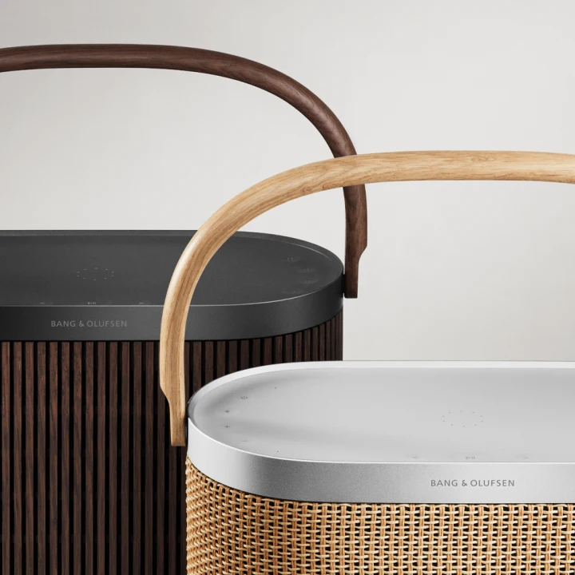
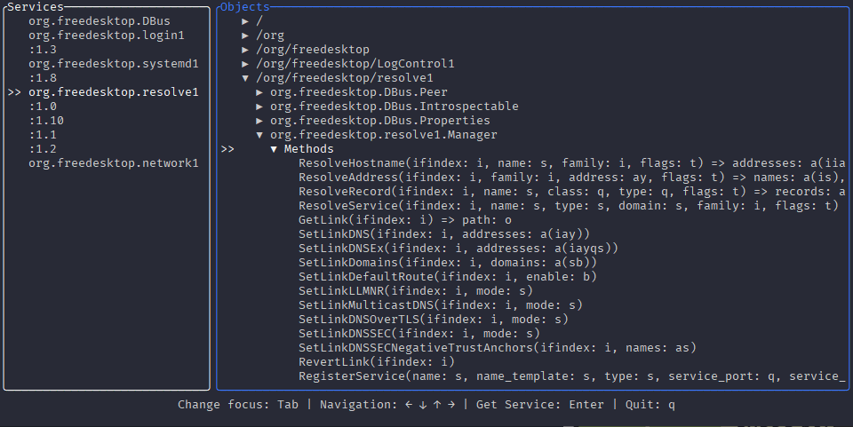
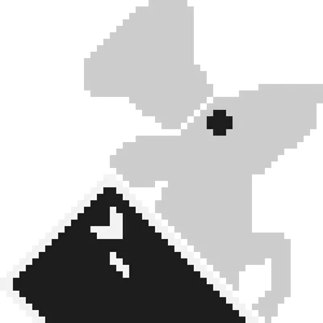
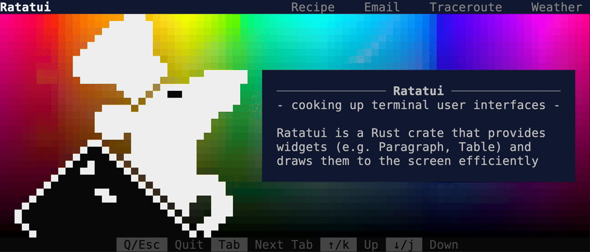
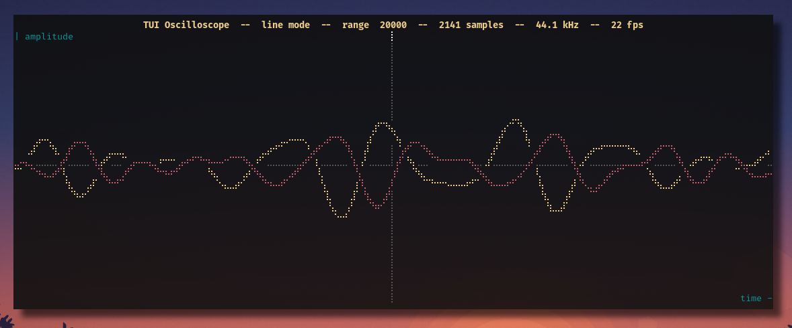
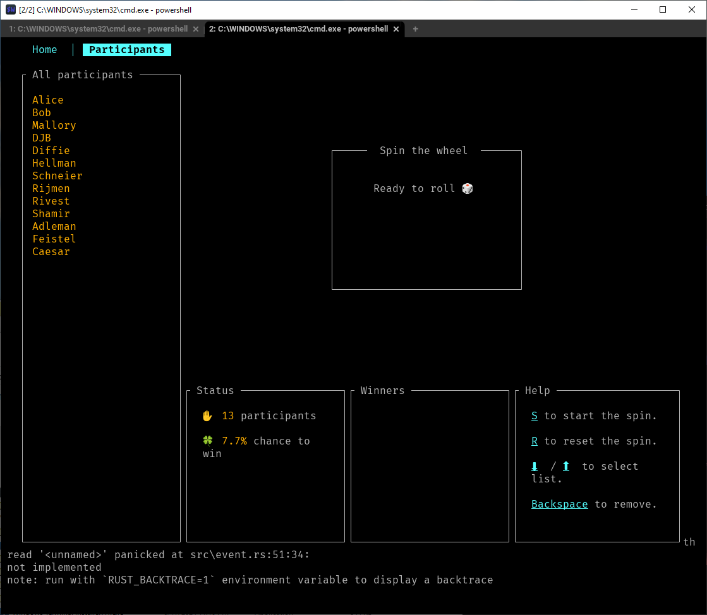
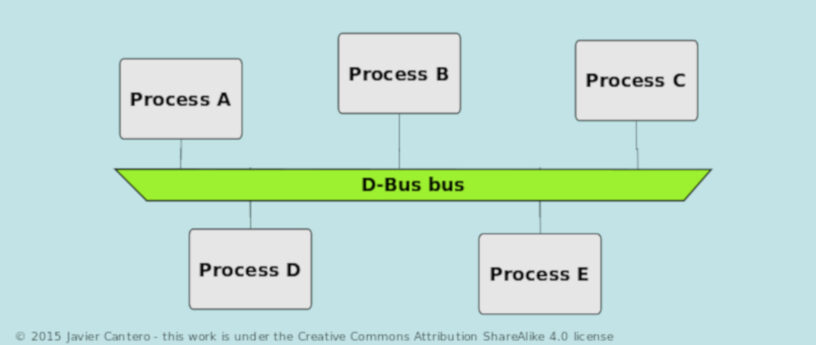
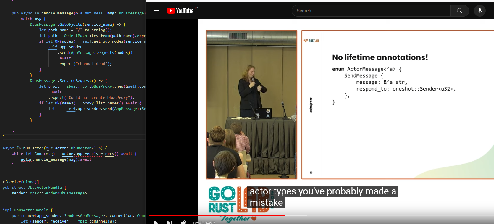

Who Am I
---

 * Engineer at Bang & Olufsen
 * Rustacean since 2019 (I think)
<!-- end_slide -->
What is this talk about
---

<!-- pause -->
<!-- new_line -->
<!-- new_line -->
# What do i hope you get from this talk
---

- A small look at how to do a TUI in Ratatui
- A dip in the pool of dbus
- Combine the 2 and see how i made dtui
<!-- end_slide -->
Ratatui
---



 * https://ratatui.rs/
<!-- pause -->

---
 * Easily create powerful Terminal immediate mode UIs
 * Compatible with multiple backend libraries (crossterm, termion, termwiz)
 * Comes with a bunch of prebuilt "widgets" like Gauges, Charts, List...
 * Fork and replacement for tui-rs, now community maintained and really successful

<!-- end_slide -->

Demo
---

<!-- end_slide -->
Bottom
---

<!-- end_slide -->
Scope TUI
---

<!-- end_slide -->
Raffle
---

<!-- end_slide -->

The basic TUI main
--- 
```rust
fn main() -> Result<()> {
  stdout().execute(EnterAlternateScreen)?;
  enable_raw_mode()?;
  let mut terminal = Terminal::new(CrosstermBackend::new(stdout()))?;
  terminal.clear()?;

  loop {
    // Draw UI
    // Handle events
  }

  stdout().execute(LeaveAlternateScreen)?;
  disable_raw_mode()?;
  Ok(())
}
```
<!-- end_slide -->

Draw UI
--- 
```rust
terminal.draw(|frame| {
    let area = frame.size();
    frame.render_widget(
        Paragraph::new("Hello Ratatui! (press 'q' to quit)")
            .white()
            .on_blue(),
        area,
    );
})?;
```
<!-- end_slide -->

Handle events
--- 
```rust
if event::poll(std::time::Duration::from_millis(16))? {
    if let event::Event::Key(key) = event::read()? {
        if key.kind == KeyEventKind::Press && key.code == KeyCode::Char('q') {
            break;
        }
    }
}
```
<!-- end_slide -->
Simple app template
--- 
```
src/
├── app.rs     -> holds the state and application logic
├── event.rs   -> handles terminal events (key press, mouse click, resize...)
├── handler.rs -> handles the key press events and updates the application
├── lib.rs     -> module definitions
├── main.rs    -> entry-point
├── tui.rs     -> initializes/exits the terminal interface
└── ui.rs      -> renders the widgets / UI
```
<!-- end_slide -->
<!-- jump_to_middle -->
dbus
===
<!-- end_slide -->

dbus
---
<!-- column_layout: [3, 2] -->
<!-- column: 0 -->
 * Message bus for interprocess communication
 * Used by a bunch of the linux services, notably systemd and bluez
 * You can call methods, get/set properties and listen for signals
 * Includes a standard interface for introspection
<!-- column: 1 -->

<!-- end_slide -->

Services
---
There is the session bus and the system bus
 * Session bus is for IPC between user processes
 * System bus is for IPC between user and system services

# Services connect to a bus, and takes a bus name
```bash +exec
busctl list
```
<!-- end_slide -->

Objects
---
# Services contain objects with an object path

```bash +exec
busctl tree org.freedesktop.resolve1
```
<!-- end_slide -->
Interfaces
---
# Objects implement interfaces

```bash +exec
busctl introspect org.freedesktop.resolve1 /org/freedesktop/resolve1 \
 | awk '{print $1, $2, $3}' | column -t
```
<!-- end_slide -->
Methods
---
# Methods on objects can be called

```bash +exec
busctl call org.freedesktop.resolve1 \
  /org/freedesktop/resolve1 \
  org.freedesktop.resolve1.Manager \
  ResolveHostname \
  isit \
  0 google.com 0 0
```
<!-- end_slide -->
Introspection
---
Objects can implement the Introspection interface, which returns an XML document describing the interfaces it implements.

And this can also contain other objects. Which means you need to do a recursive introspect, to get the complete tree in a service

```bash +exec
busctl introspect org.freedesktop.resolve1 / --xml
```
<!-- end_slide -->

Libraries
---
 * libdbus => freedesktop
 * sd-bus => systemd
 * zbus :)
<!-- end_slide -->
<!-- jump_to_middle -->
dtui
===
<!-- end_slide -->
The App
---
```
                                                 
 ┌───────────┐                  ┌─────────────►┐ 
 ▲           │     Request      ▲              │ 
 │           │ Services/Objecst │              │ 
 │   APP     ├─────────────────►│    DBUS      │ 
 │ EventLoop │                  │   Actor      │ 
 │           ▼                  │              ▼ 
 │           │◄─────────────────┤              │ 
 └───◄───────┘    Services/     └───────◄──────┘ 
                  Objects                        
                                              
```
<!-- column_layout: [2, 2] -->
<!-- column: 0 -->
```rust
pub struct App {
    dbus_rx: Receiver<AppMessage>,
    dbus_handle: DbusActorHandle,
    pub services: StatefulList<OwnedBusName>,
    pub objects: StatefulTree,
    pub working_area: WorkingArea,
}

```
<!-- column: 1 -->
```rust
pub enum DbusMessage {
    GetObjects(OwnedBusName),
    ServiceRequest(),
}
pub enum AppMessage {
    Objects(HashMap<String, Node<'static>>),
    Services(Vec<OwnedBusName>),
}
```
<!-- end_slide -->
---
## Thank you Alice


<!-- end_slide -->
App loop
---
```rust
// Get current services
app.dbus_handle.request_services().await;

loop {
  terminal.draw(|frame| ui::<B>(frame, &mut app))?;
  match app.dbus_rx.try_recv() {
    ...
  }
  ...
  if crossterm::event::poll(timeout)? {
    if let Event::Key(key) = event::read()? {
        match key.code {
          KeyCode::Char('q') => return Ok(()),
          KeyCode::Enter => match app.working_area {
              WorkingArea::Services => {
                  if let Some(selected_index) = app.services.state.selected() {
                      let item = app.services.items[selected_index].clone();
                      app.dbus_handle.request_objects_from(item).await;
                  }
              }
          }
          ... // Handle other keys
}

```
<!-- end_slide -->
Dbus loop
---
```rust +line_numbers
pub async fn handle_message(&mut self, msg: DbusMessage) {
    match msg {
        DbusMessage::GetObjects(service_name) => {
            let path_name = "/".to_string();
            let path = ObjectPath::try_from(path_name).expect("/ is always a valid path");
            if let Ok(nodes) = self.get_sub_nodes(&service_name, &path).await {
                self.app_sender
                    .send(AppMessage::Objects(nodes))
                    .await
                    .expect("channel dead");
            }
        }
        DbusMessage::ServiceRequest() => {
            let proxy = zbus::fdo::DBusProxy::new(&self.connection)
                .await
                .expect("Could not create DbusProxy");
            if let Ok(names) = proxy.list_names().await {
                let _ = self.app_sender.send(AppMessage::Services(names)).await;
            }
        }
    }
}
```
<!-- end_slide -->
Introspecting dbus
---
```rust +line_numbers
async fn get_node(
    &self,
    service_name: &OwnedBusName,
    path: &ObjectPath<'_>,
) -> Result<Node<'static>, Box<dyn Error + Sync + Send>> {
    let introspectable_proxy = zbus::fdo::IntrospectableProxy::builder(&self.connection)
        .destination(service_name)?
        .path(path.clone())?
        .build()
        .await?;
    let introspect_xml: String = introspectable_proxy.introspect().await?;
    let introspect = Node::from_reader(BufReader::new(introspect_xml.as_bytes()))?;
    Ok(introspect)
}
```
<!-- end_slide -->

Getting everything
---
```rust
#[async_recursion]
async fn get_sub_nodes(
    &self,
    service_name: &OwnedBusName,
    path: &ObjectPath<'async_recursion>,
) -> Result<HashMap<String, Node<'static>>, Box<dyn Error + Send + Sync>> {
    let mut result = HashMap::new();
    let node = self.get_node(service_name, path).await?;

    for sub_node in node.nodes() {
        if let Some(name) = sub_node.name() {
            let path_name = if path.as_str().ends_with('/') {
                path.as_str().to_string() + name
            } else {
                path.as_str().to_string() + "/" + name
            };
            let sub_path = ObjectPath::try_from(path_name)?;
            result.extend(self.get_sub_nodes(service_name, &sub_path).await?)
        }
    }
    result.insert(path.to_string(), node);
    Ok(result)
}
```
<!-- end_slide -->

The UI
---
```rust {3-6|7-10|11-19} +line_numbers
pub fn ui<B: Backend>(frame: &mut Frame, app: &mut App) {
    // Create two chunks with equal horizontal screen space
    let full = Layout::default()
        .direction(Direction::Vertical)
        .constraints([Constraint::Min(5), Constraint::Max(2)])
        .split(frame.size());
    let chunks = Layout::default()
        .direction(Direction::Horizontal)
        .constraints([Constraint::Percentage(25), Constraint::Percentage(75)].as_ref())
        .split(full[0]);
    let items: Vec<ListItem> = app
        .services
        .items
        .iter()
        .map(|i| {
            let lines = Span::from(i.as_str());
            ListItem::new(lines).style(Style::default())
        })
        .collect();
```
<!-- end_slide -->
```rust {2-11|14|16-26|27|28-31} +line_numbers
    // Create a List from all list items and highlight the currently selected one
    let items = List::new(items)
        .block(
            Block::default()
                .borders(Borders::ALL)
                .title("Services")
                .border_type(BorderType::Rounded)
                .border_style(Style::default().fg(working_area_border(app, WorkingArea::Services))),
        )
        .highlight_style(Style::default().add_modifier(Modifier::BOLD))
        .highlight_symbol(">> ");

    // We can now render the item list
    frame.render_stateful_widget(items, chunks[0], &mut app.services.state);

    let objects_view = Tree::new(app.objects.items.clone())
        .unwrap()
        .block(
            Block::default()
                .borders(Borders::ALL)
                .border_type(BorderType::Rounded)
                .border_style(Style::default().fg(working_area_border(app, WorkingArea::Objects)))
                .title("Objects"),
        )
        .highlight_style(Style::default().add_modifier(Modifier::BOLD))
        .highlight_symbol(">> ");
    frame.render_stateful_widget(objects_view, chunks[1], &mut app.objects.state);
    let bottom_text =
        Span::raw("Change focus: Tab | Navigation: ← ↓ ↑ → | Get Service: Enter | Quit: q");
    let helper_paragraph = Paragraph::new(bottom_text).alignment(Alignment::Center);
    frame.render_widget(helper_paragraph, full[1]);
}
```
<!-- end_slide -->
