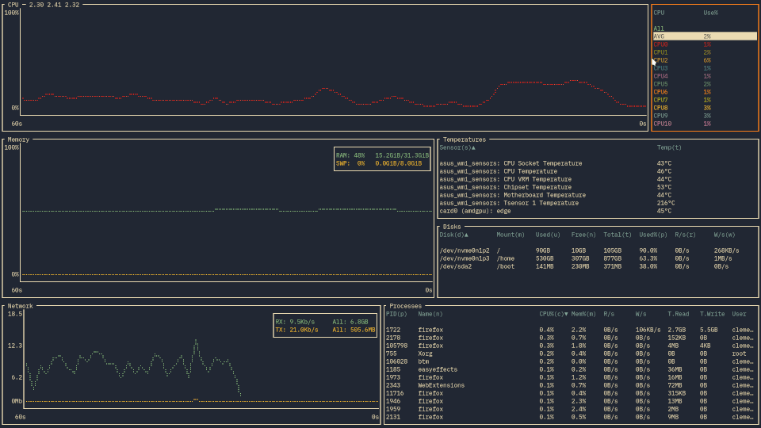

Who Am I
---

 * Engineer at Bang & Olufsen
 * Rustacean since 2019 (I think)
<!-- end_slide -->
What is this talk about
---

<!-- end_slide -->
What do i hope you get from this talk
---

- A small look at how to do a TUI in Ratatui
- A dip in the pool of dbus and how to use the zbus crate
<!-- end_slide -->
Ratatui
---


 * https://ratatui.rs/
<!-- end_slide -->
---
 * Easily create powerful Terminal UIs
 * Compatible with multiple backend libraries (crossterm, termion, termwiz)
 * Comes with a bunch of prebuilt "widgets" like Gauges, Charts, List...
 * Fork and replacement for tui-rs, now community maintained and really successful
<!-- end_slide -->

Demo
---

<!-- end_slide -->

Bottom
---

<!-- end_slide -->
Scope TUI
---

<!-- end_slide -->
Raffle
---

<!-- end_slide -->
zbus
---

 * https://dbus2.github.io/zbus/
<!-- end_slide -->
The App
---
```rust
pub struct App {
    dbus_rx: Receiver<AppMessage>,
    dbus_handle: DbusActorHandle,
    pub services: StatefulList<OwnedBusName>,
    pub objects: StatefulTree,
    pub working_area: WorkingArea,
}
```
<!-- end_slide -->
---
## Thank you Alice


<!-- end_slide -->